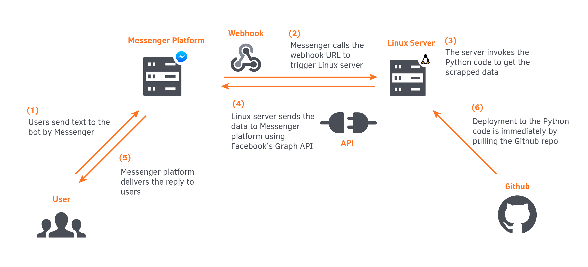

👓 RentBot 是一個基於 Python 寫成的 Messenger 聊天機器人。想快速找房不必特意下載其他 APP，只要開始對話，RentBot 就能依照地點、預算偏好等條件快速推薦最符合你的房源。

RentBot is a Facebook Messenger bot written in Python that helps people to find a house rental easily without downloading additional apps. Simply start conversation, and Rentbot will recommend you the best match based on your preferences.

☕️ 作者：醫學五／何宣霖、許鈞傑、曾敬華、蔡尚澤

👾 RentBot 目前在開發人員版本中，尚未通過 Facebook 審核。不過你仍然可以拜訪[RentBot的粉絲專頁](https://facebook.com/ask.rentbot/)。

## 🚀 程式名稱
租霸 RentBot
## 💡 創作理念
今年（2017）接觸學校開設的「Python與資料科學概論」後，我們在當時根據所學寫出租屋網爬蟲的雛形，在[期末發表](https://github.com/dizzybaron/TMUrealEstate)中以問答方式過濾出最適配房源。
不過在當時受於時間以及能力的限制，程式有諸多缺陷，包含：
1. 對於程式想解決的核心問題團隊沒有明確定義，導致程式功能雜亂
2. 對於動態網頁處理能力不佳，爬蟲結果只能得到第一頁的資料
3. 沒有合適的使用者介面，無法發佈給一般使用者

因此，這次我們修正以上問題，希望能讓這段程式碼發揮更大的價值。

我們在開發的過程中了解到這個程式需要的是**簡單的篩選房源**多於**創新的篩選方式**。因此在這個版本，我們取消部分功能，著重在
* 提供更多常用房源篩選條件
* 獲取更多筆資料

再者，由於程式具有**輕量化**以及**對話式**的特性，我們認為開發為聊天機器人是很合適的選擇。因此，RentBot 就這麼誕生了。

## 🤖 功能說明（執行成果畫面圖文說明）

## 🚦 程式流程、資料分析流程或系統架構圖

聊天機器人的架構主要參考自 [Facebook for developers 官方技術文件](https://developers.facebook.com/products/messenger/overview/)。
1. 使用者將訊息經 RentBot 傳送至 Messenger Platform
2. Messenger Platform 透過 Webhook 與後端伺服器連接。
3. 伺服器收到指令，執行 `.py` 檔案
4. 伺服器透過 API 將結果傳回 Messenger Platform
5. RentBot 發送訊息給使用者
6. 後端伺服器的更新透過 Github 多人協作並即時同步穩定版本

## 🎯 程式開發與執行環境說明
房源資料主要來自 591 租屋網站。資料爬蟲上使用 [Selenium](http://www.seleniumhq.org) 套件輔助，抓取後使用 [BeautifulSoup](https://www.crummy.com/software/BeautifulSoup/bs4/doc/) 、[Pandas](https://pandas.pydata.org) 操作資料。
